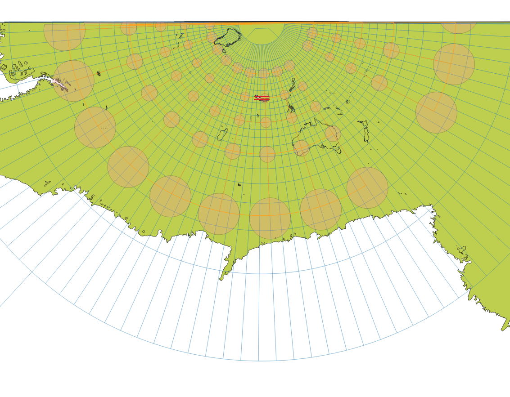
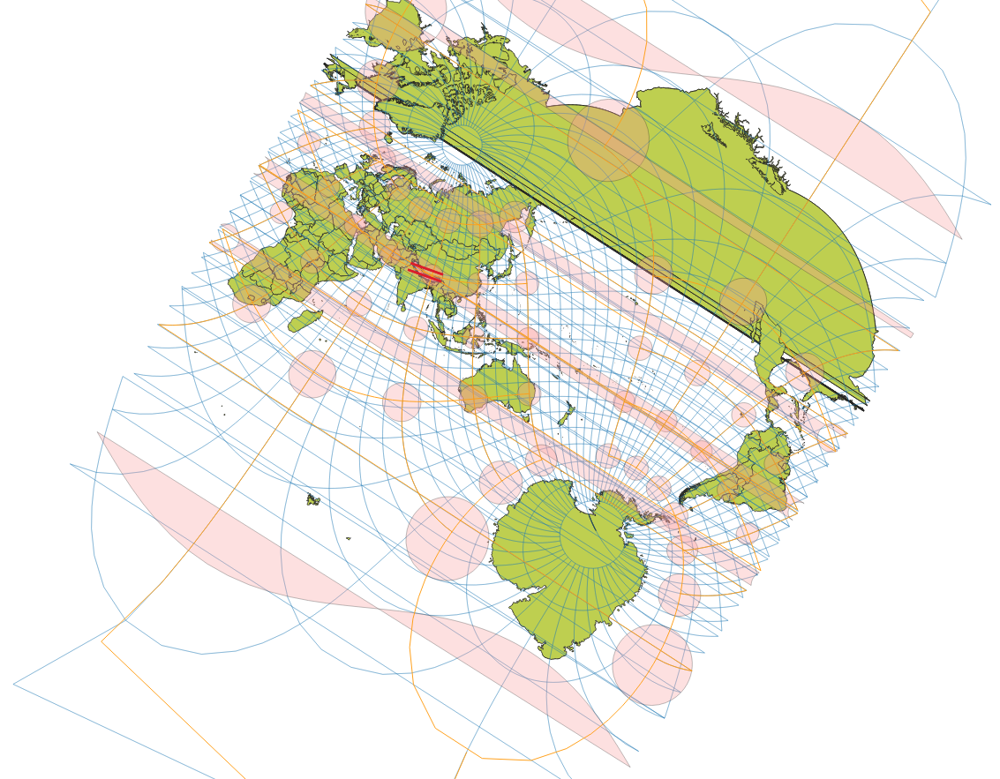
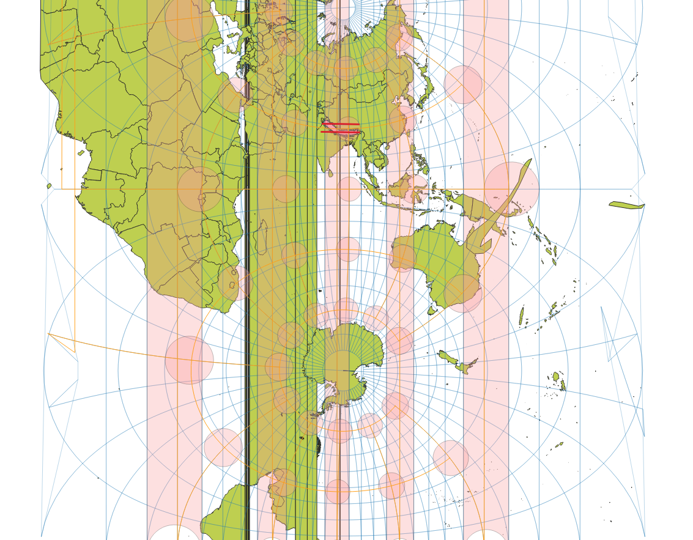

# Projection Considerations

When calculating projected metrics (slope, area etc) on the Himalayas strip,
I had to consider the tradeoff between splitting the layer to the 4 intersecting UTM zones (`UTM-43N` - `UTM-46N`)
or using a custom projection tailored to the AOI (Area Of Interest, `data/himalayas.geojson`).

Splitting to multiple UTM zones will results in a more accurate analysis, but at an increased algorithmic complexity and additional projection function calls.

To evaluate the different projections (CRSs), I created and used the script `./scripts/get-crs-stats.py` and computed distortion statistics on 2 different CRSs: **LCC** (Lambert Conformal Conic) and **OMERC** (Oblique Mercator).

It is important to consider the **p99 distortion** as much as we consider the max distortion, as max operation highlight outliers while p99 doesn't.

The preview images of the projections include 2 red lines across the Himalayas - those are the 1/4 and 3/4 latitude parallels used in LCC and OMERC.

## LCC (Lambert Conformal Conic)
The Himalayas is a long east-west strip located at middle north latitude, perfectly positioned for LCC (as stated in proj docs).  
The 2 standard parallels were chosen at 1/4 and 3/4 of the AOI, minimizing the overall error rate.

- **Docs**: [lcc html page](https://proj.org/en/stable/operations/projections/lcc.html)  
- **Error Rates**: Compared to UTM at **worst case scenario**, N-S & E-W scale distortion rates are only ≤0.0759% higher (i.e. 0.7m per kilometer less accurate), and areal distortion is ≤0.152% higher (i.e. 1.52m per kilometer less accurate).  
- **Best Use-case**: LCC is conformal, meaning it minimizes distortion locally. Slope and Aspect fits LCC. Area based aggregations are less appropriate.  



```
./scripts/get-crs-stats.py --proj4 '+proj=lcc +lat_1=28 +lat_2=32 +lat_0=30 +lon_0=85 +x_0=0 +y_0=0 +datum=WGS84 +units=m +no_defs' --region data/himalayas.geojson
=== Projection WKT ===
...

=== Region bounds (EPSG:4326 degrees) ===
lon_min=75.521861 lon_max=95.662608 lat_min=26.859809 lat_max=33.911933
step_deg=0.05

=== Sampling ===
candidate_grid=403x142 candidate_samples=57226
samples_inside_region=17504

=== Distortion summary ===
                    metric                min                p50                     p95                     p99                     max max_abs_pct
         k_mer (N-S scale) 0.999394(-0.0606%) 0.999803(-0.0197%)       1.00078(+0.0776%)        1.00133(+0.133%)        1.00174(+0.174%)      0.174%
         k_par (E-W scale) 0.999394(-0.0606%) 0.999803(-0.0197%)       1.00078(+0.0776%)        1.00133(+0.133%)        1.00174(+0.174%)      0.174%
k_dist (sqrt(k_mer*k_par)) 0.999394(-0.0606%) 0.999803(-0.0197%)       1.00078(+0.0776%)        1.00133(+0.133%)        1.00174(+0.174%)      0.174%
   anisotropy (tissot a/b)             1(+0%)             1(+0%)           1(+2.11e-06%)           1(+2.98e-06%)           1(+3.65e-06%)            
        angular_distortion             0(+0%)             0(+0%) 1.20813e-06(+0.000121%) 1.70717e-06(+0.000171%) 2.09136e-06(+0.000209%)            
      k_areal (area scale)  0.998788(-0.121%) 0.999605(-0.0395%)        1.00155(+0.155%)        1.00267(+0.267%)        1.00348(+0.348%)      0.348%
```

## OMERC (Oblique Mercator)
The Himalayas is a **tilted** east-west strip, so to beat UTM at its own game, we craft a UTM-like CRS tilted to fit the AOI.
The centerline was derived from the 2 opposing vertices of LCC's standard parallels.

- **Docs**: [omerc html page](https://proj.org/en/stable/operations/projections/omerc.html)  
- **Error Rates**: Being equal or better than UTM across the board, N-S & E-W scale distortion rates are ≤0.0096% **lower** (i.e. 9.6cm per kilometer more accurate), and areal distortion is ≤0.019% **lower** (i.e. 0.19m per kilometer more accurate).  
- **Best Use-case**: Being a localized UTM-like projection, I can treat OMERC the same way I treat standard UTM zones at their intendant regions.  



```
./scripts/get-crs-stats.py --proj4 '+proj=omerc +lon_1=75 +lat_1=32 +lon_2=95 +lat_2=28 +k_0=0.9996 +x_0=0 +y_0=0 +datum=WGS84 +units=m +no_defs' --region data/himalayas.geojson
=== Projection WKT ===
...

=== Sampling ===
candidate_grid=403x142 candidate_samples=57226
samples_inside_region=17504

=== Distortion summary ===
                    metric                min                p50                     p95                     p99                     max max_abs_pct
         k_mer (N-S scale) 0.999496(-0.0504%) 0.999704(-0.0296%)          1.0005(+0.05%)       1.00073(+0.0734%)       1.00089(+0.0885%)     0.0885%
         k_par (E-W scale) 0.999496(-0.0504%) 0.999704(-0.0296%)          1.0005(+0.05%)       1.00073(+0.0734%)       1.00089(+0.0885%)     0.0885%
k_dist (sqrt(k_mer*k_par)) 0.999496(-0.0504%) 0.999704(-0.0296%)          1.0005(+0.05%)       1.00073(+0.0734%)       1.00089(+0.0885%)     0.0885%
   anisotropy (tissot a/b)             1(+0%)             1(+0%)           1(+2.11e-06%)           1(+2.98e-06%)           1(+3.65e-06%)            
        angular_distortion             0(+0%)             0(+0%) 1.20802e-06(+0.000121%) 1.70743e-06(+0.000171%) 2.09235e-06(+0.000209%)            
      k_areal (area scale)  0.998992(-0.101%) 0.999408(-0.0592%)            1.001(+0.1%)        1.00147(+0.147%)        1.00177(+0.177%)      0.177%
```

## UTM (reference)
Computing the distortion in the well intended region of a UTM zone (one of the standard way of doing local projected analysis) makes it easier to evaluate the distortion cost of using custom projections:



```
./scripts/get-crs-stats.py   --proj4 '+proj=utm +zone=45 +north +datum=WGS84 +units=m +no_defs'   --region data/utm_45n.geojson
=== Projection WKT ===
...

=== Region bounds (EPSG:4326 degrees) ===
lon_min=84.000000 lon_max=90.000000 lat_min=0.000000 lat_max=84.000000
step_deg=0.05

=== Sampling ===
candidate_grid=121x1681 candidate_samples=203401
samples_inside_region=201480

=== Distortion summary ===
                    metric            min                p50                   p95                     p99                     max max_abs_pct
         k_mer (N-S scale) 0.9996(-0.04%) 0.999711(-0.0289%)     1.00054(+0.0536%)       1.00082(+0.0815%)       1.00098(+0.0981%)     0.0981%
         k_par (E-W scale) 0.9996(-0.04%) 0.999711(-0.0289%)     1.00054(+0.0536%)       1.00082(+0.0815%)       1.00098(+0.0981%)     0.0981%
k_dist (sqrt(k_mer*k_par)) 0.9996(-0.04%) 0.999711(-0.0289%)     1.00054(+0.0536%)       1.00082(+0.0815%)       1.00098(+0.0981%)     0.0981%
   anisotropy (tissot a/b)         1(+0%)             1(+0%)         1(+2.58e-06%)           1(+2.98e-06%)           1(+4.21e-06%)            
        angular_distortion         0(+0%)             0(+0%) 1.479e-06(+0.000148%) 1.70751e-06(+0.000171%) 2.41473e-06(+0.000241%)            
      k_areal (area scale) 0.9992(-0.08%) 0.999422(-0.0578%)      1.00107(+0.107%)        1.00163(+0.163%)        1.00196(+0.196%)      0.196%
```